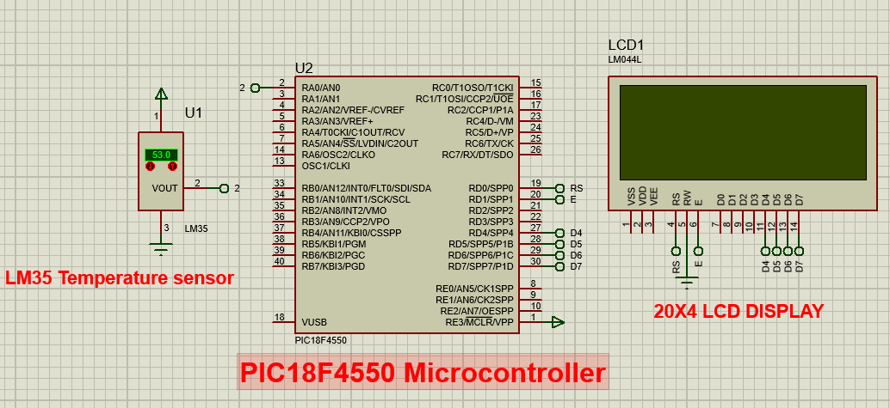

# Microprocessors and Interfacing: LM35 Temperature Sensor & 20x4 LCD with PIC18F4550
This repository contains a microprocessor interfacing project that demonstrates **temperature measurement using an LM35 sensor** and displaying the readings on a **20x4 LCD** using the **PIC18F4550** microcontroller. The project is implemented using **Proteus 8.10** for simulation and **MPLAB X IDE with XC8 Compiler** for code development.

## Repository Structure:

```bash
📂 Microprocessors_and_Interfacing_LM35_PIC18_20X4_LCD
├── 📂 HexFile
│   └── PIC18F4550.X.production.hex
├── 📂 Header file
│   └── xc.h
├── 📂 SourceCode
│   └── main.c
├── 📂 ProteusProject
│   └── LM35-PIC18-20X4LCD.pdsprj
├── 📂 Documentation
│   ├── Project Report 1.pdf
│   ├── Circuit_Diagram.png
├── LICENSE
├── README.md
└── requirements.txt


```

## Table of Contents

- [Project Overview](#project-overview)
- [Circuit Diagram](#circuit-diagram)
- [Installation](#installation)
- [Usage](#usage)
- [Software and Tools](#software-and-tools)
- [Dependencies](#dependencies)
- [Authors](#authors)
- [License](#license)

## Project Overview

This project involves interfacing an **LM35 temperature sensor** with a **PIC18F4550 microcontroller** to display temperature readings on a **20x4 LCD**. The system operates as follows:

- **Row 1:** Displays the temperature value (e.g., `25.3°C`).
- **Row 2:** Shows the unit (`°C`).
- **Row 3:** Displays `"The temperature is:"`.
- **Row 4:** Displays a **descriptive message** based on the temperature value:
  - `<= 15°C` → **Cold**
  - `15°C < T <= 27°C` → **Normal**
  - `27°C < T <= 30°C` → **Warm**
  - `> 30°C` → **Hot**
 
## Circuit Diagram
   

## **Installation**
### **1. Clone the Repository**
```bash
git clone https://github.com/Kaleabt37/Microprocessors_and_Interfacing_LM35_PIC18_20X4_LCD.git
cd Microprocessors_and_Interfacing_LM35_PIC18_20X4_LCD
```
### **2. Open the Proteus Project**

- Navigate to the ProteusProject folder
- Open the LM35-PIC18-20X4LCD project file in Proteus

### **3. Load the HEX File**

- In Proteus, double-click the PIC18F4550 microcontroller
- In the Program File section, click the folder icon
- Navigate to HexFile/ and select the PIC18F4550.X.production.hex file

### **4. Run the Simulation**

- Click Run Simulation and observe the LCD displaying the temperature readings


## **Usage**
### **1. Microcontroller Behavior**

- LM35-Based Temperature Display on 20x4 LCD:
  - Temperature <= 15°C → LCD displays 'Cold'  
  - 15°C < Temperature <= 27°C → LCD displays 'Normal'  
  - 27°C < Temperature <= 30°C → LCD displays 'Warm'  
  - Temperature > 30°C → LCD displays 'Hot'  

### **2. How to Modify the Code**

- Open the main.c file located in SourceCode/
- Modify the logic inside main.c as needed
- Recompile the code using MPLAB X IDE
- Generate a new HEX file and update the Proteus simulation


## **Software and Tools**
```bash
|   Software   |            Purpose           |
|--------------|------------------------------|
| Proteus 8.10 | Circuit simulation           |
| MPLAB X IDE  | Writing and compiling C code |
| XC8 Compiler | Generating HEX files         |
```

## **Dependencies**

- This project requires the following tools:
  - Proteus 8.10 (for circuit design and testing)
  - MPLAB X IDE (for developing and compiling the C code)
  - XC8 Compiler (for compiling the source code)

## **Authors**

- This project was developed by Kaleab Tesfaye


## **License**

- This project is licensed under the MIT License – see the LICENSE file for details.

